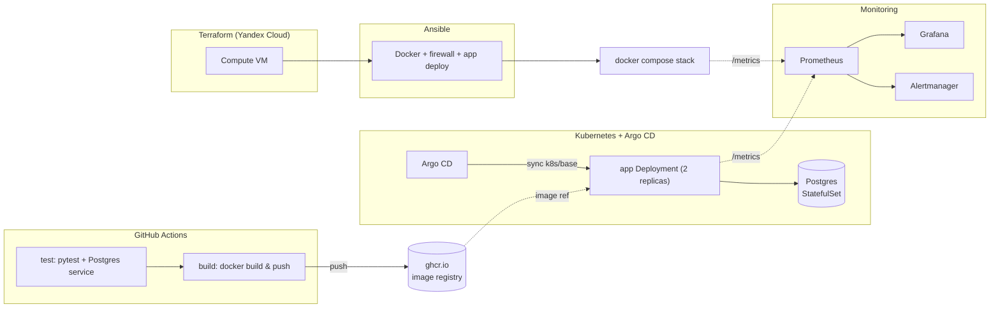

# devops-lab

[](https://github.com/tarnished000/devops-lab/actions/workflows/ci.yml)
[](LICENSE)
[](app/requirements.txt)
[](app/Dockerfile)

A personal, production-style DevOps lab I built to go from Linux/sysadmin
work into DevOps: a small FastAPI + PostgreSQL app, wrapped end to end in
the tooling a real deployment would use — Docker, CI/CD, configuration
management, GitOps on Kubernetes, and infrastructure as code, with
monitoring wired in throughout.

The app itself (`app/`) is deliberately simple: a "notes" CRUD API. It's
not meant to be interesting on its own — it exists to be the thing the
rest of the repo builds, deploys, monitors, and automates.

> This GitHub copy mirrors my primary development repo (GitLab). CI/CD
> here runs on GitHub Actions + GitHub Container Registry (`ghcr.io`)
> instead of GitLab CI + the GitLab Registry, so the pipeline is native
> to GitHub rather than just copied over.

## Architecture



## Tech stack

- **App**: Python 3.12, FastAPI, SQLAlchemy, PostgreSQL 16
- **Containers**: Docker, Docker Compose, nginx (reverse proxy)
- **CI/CD**: GitHub Actions, GitHub Container Registry (ghcr.io)
- **Config management**: Ansible (Docker install, firewall, app deploy roles)
- **Orchestration / GitOps**: Kubernetes (Kustomize), Argo CD
- **Infrastructure as code**: Terraform, Yandex Cloud
- **Monitoring**: Prometheus, Grafana, Alertmanager

## Status by stage

I'd rather this table be accurate than impressive. Every stage below is
real, working-quality code — not stubs — but a few of them need
something only I can do by hand outside of CI (mainly: pay for and
provision real cloud infrastructure) before they've actually been *run*,
as opposed to just *written*.

| Stage | Status |
| --- | --- |
| Docker (app + nginx + Postgres) | Written. Run it yourself with `docker compose up -d --build` — see Quickstart below. |
| CI/CD (GitHub Actions + ghcr.io) | **Running.** Every push tests against a real Postgres service, then builds and pushes the image to `ghcr.io` using the built-in `GITHUB_TOKEN` — no manual setup needed. See the badge above or the [Actions tab](https://github.com/tarnished000/devops-lab/actions). |
| Ansible | Written (`ansible/`: Docker install, ufw firewall, app deploy roles). Not yet applied — there's no server to target yet; `inventory.ini` is a placeholder until Terraform provisions one. |
| Kubernetes + Argo CD (GitOps) | Written (`k8s/`, `argocd/`), Kustomize-valid. Not yet applied — no cluster exists yet; it's meant to be pointed at whatever Terraform provisions. |
| Terraform (Yandex Cloud) | Written (`terraform/`). Not yet applied — provisioning needs a real Yandex Cloud account with billing and a personal IAM token, done by hand from outside CI. |
| Monitoring (Prometheus/Grafana/Alertmanager) | Wired into `docker-compose.yml` and into the app itself (`/metrics`). Same caveat as Docker: written and internally consistent, not yet watched running live. |

## Layout

```
app/            FastAPI + SQLAlchemy "notes" API, Dockerfile, tests
nginx/          Reverse proxy config for the app
ansible/        Server configuration (Docker, firewall, app deploy)
k8s/            Kustomize manifests for the app + Postgres
argocd/         Argo CD Application (GitOps sync of k8s/)
terraform/      Yandex Cloud infrastructure (VPC, VM)
monitoring/     Prometheus, Alertmanager, Grafana provisioning
docker-compose.yml            Local stack: app + db + nginx + monitoring
.github/workflows/ci.yml      CI: test, then build + push image to ghcr.io
```

## Quickstart

```bash
git clone https://github.com/tarnished000/devops-lab.git
cd devops-lab
cp .env.example .env
docker compose up -d --build
```

- App (via nginx): http://localhost:8080
- Prometheus: http://localhost:9090
- Alertmanager: http://localhost:9093
- Grafana: http://localhost:3000

Each stage has its own README with the full details and exact commands:
[`ansible/README.md`](ansible/README.md), [`k8s/README.md`](k8s/README.md),
[`terraform/README.md`](terraform/README.md),
[`monitoring/README.md`](monitoring/README.md).

## License

[MIT](LICENSE)
